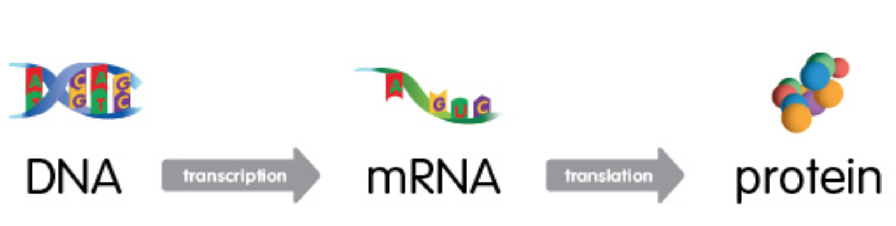
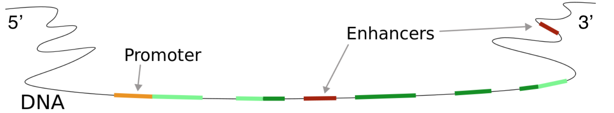
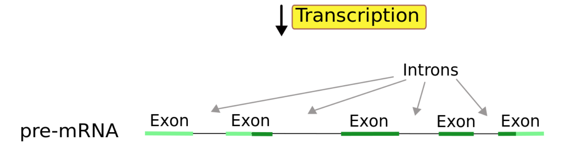

# Uvod {#uvod}

Dezoksiribonukleinska kiselina (DNA) se nalazi u unutrašnjosti ćelija, organizovana u obliku hromozoma - dugačkih vlaknastih struktura. Kod čoveka je hromozom dvostruki, spiralno uvijeni lanac od 50 do 250 miliona nukleotida. Segment tog niza koji kodira RNA (ribonukleinska kiselina) molekul naziva se gen, a ceo skup genetskih instrukcija koje nosi neki organizam - genom. Humani genom sadrži nešto više od 20,000 gena.

Poznato nam je da u svakoj ćeliji našeg organizma imamo praktično isti DNA (osim u haploidnim polnim ćelijama), ali isto tako znamo i da neke od tih ćelije vrše potpuno različite funkcije. Metabolizam ćelije kože i ćelije nervnog sistema se razlikuje, ali zašto kada je osnovni genetski kod isti?

## The central dogma of molecular biology

(over)simplified: “DNA makes RNA, RNA makes proteins, proteins make us.”

Centralna dogma molekularne biologije definise smer protoka biološke informacije: DNA kodira RNA, a RNA kodira protein (naravno, da bi regulacija bila moguća postoje i efekti suprotnog smera).

I RNA i DNA molekuli su nizovi nukleotida. Nukleotidi koji čine DNA su adenin (A), guanin (G), citozin (C) i timin (T), dok se kod RNA timin zamenjuje uracilom (U).

- Transcription
- Splicing
- Translation

Genes active and their transcription rates and different for different cells.

Informacija sadržana u segmentu DNA niza se može kopirati u RNA (kroz proces koji nazivamo 'transkripcija' uz posredstvo enzima RNA-polimeraze), informacijska RNA (mRNA) nastaje od pre-mRNA (procesom 'splajsovanja', u kojem se uklanjaju tzv. intronske regije/introni) i proteini se sintetišu nizanjem amino kiselina po mRNA šablonu ('translacija'). Translacija se obavlja unutar ribozoma, organele sačinjene od ribozomalne RNA (rRNA) i proteina.

<iframe width="560" height="315" src="https://www.youtube.com/embed/2BwWavExcFI" frameborder="0" allowfullscreen></iframe>

There are other types of RNA besides messenger RNA (mRNA): transfer RNA (tRNA), ribosomal RNA (rRNA), small and long non coding RNA (ncRNA).

Tipovi RNA: informacijska ili messenger RNA (mRNA) zastupljena je sa oko ~5% u ćelijama sisara, ribozomalna RNA (rRNA) ~80%, transportna RNA koja takođe učestvuje u procesu translacije (tRNA) ~15% ... 

 

Na enhancere se vezuju transcription faktori koji interaguju sa RNA-polimerazom (koja se vezuje na promoterski region gena) i povećavaju šansu da dođe to transkripcije. Postoje i regije koje imaju suprotnu regulatornu ulogu: silenceri.

UTR = untranslated region, ne kodira protein

From a single gene, multiple **transcripts**(**isoforms**) can (and usually will) be formed.

 

Alternativno splajsovanje je proces kojim od pre-mRNA koji je doslovno prepisan DNA kod nastaje mRNA koji će kodirati protein. Splajsovanjem dolazi do odstranjivanja intronskih regija (introna), ali se isto može desiti i pojedinim eksonima. Rezultujući različiti mRNA molekuli mogu biti translirani u različite proteine, odnosno - jedan gen može da kodira više proteina.

Alternativno splajsovanje se javlja kao normalna pojava kod eukariota, gde znatno povećava raznovrsnost proteina. Kod ljudi preko 80% gena su alternativno splajsovani. Brojni modovi alternativnog splajsovanja su uočeni, od kojih najčešći jeste preskakanje eksona. U tom modu, pojedini ekson može biti uključen u mRNA pod nekim uslovima ili u pojedinim tkivima, i izostavljen iz mRNA u drugim.

Ovo je nešto što će otežati problem alignmenta (poravnanja) na referentni genom. Aligner mora biti 'splice aware'!

Rezultat splajsinga nazivamo 'transkript' (ili 'izoforma'). To je jedna od varijanti mRNA molekula koja može nastati od nekog gena. Ekvivalentno relaciji gen-genom, 'katalog' svih mogućih transkripata nazivamo 'transkritom'.

## Why measure gene expression?

Proteini (belančevine) predstavljaju za žive sisteme najznačajnije organske molekule. Osim što izgrađuju ćeliju i njene delove, proteini obavljaju i sve osnovne funkcije u organizmu. 

Izuzetno je komplikovano direktno izmeriti relativnu zastupljenost određenog proteina u uzorku. Zato merimo relativnu zastupljenost mRNA molekula koji kodira taj protein!

**Because gene expression correlates with protein expression!**

Even though nearly every cell in an organism's body contains the same set of genes, only a fraction of these genes are used in any given cell at any given time. It is this carefully controlled pattern of what is called "gene expression" that makes a liver cell different from a muscle cell, and a healthy cell different from a cancer cell. 

By measuring gene expression, we can identify active and inactive genes in a cell or tissue. This knowledge is important for drug discovery and creating diagnostic tests.

## Before sequencing - library prep!

Choosing the appropriate sequencing protocol:

- Most of the RNA in a cell is ribosomal RNA (an RNA component of ribosome which is approx 60% rRNA and 40% protein). This is an issue since most scientists (and enthusiasts like us) will be interested in mRNA because of its protein coding function. There are two popular methods for increasing mRNA concentration in your samples:

    1. poly (A) capture 
    2. ribosomal RNA depletion
    
- There are also total-RNA protocols that do not enrich for a specific RNA type - for "total RNA" studies;
- Different fragment sizes;
- Bulk or single cell RNA-Seq;
- ...

Then what? Microarrays or RNA-Seq!

### DNA microarrays

- Around since late 80's.
- Microscope slides with thousands of tiny spots, each spot containing a known DNA sequence or gene. These sequences act as probes to detect gene expression.
- Molecules in the sample are labeled with fluorescent probes.
- The process in which the sample molecules bind to the DNA probes on the slide is called hybridization. 
- Following hybridization, the microarray is scanned to measure the expression of each gene printed on the slide. 
    
<iframe width="560" height="315" src="https://www.youtube.com/embed/1_wDrqgS8w8" frameborder="0" allowfullscreen></iframe>

### RNA-Seq

- A major breakthrough (replaced microarrays) in the late 00’s and has been widely used since.
- Uses next-generation sequencing (NGS) to reveal the presence and quantity of RNA in a biological sample at a given moment.
- Able to detect novel (undiscovered) isoforms and has a broader dynamic range compapred to microarrays.

    
<iframe width="560" height="315" src="https://www.youtube.com/embed/womKfikWlxM" frameborder="0" allowfullscreen></iframe>

### RNA-Seq analysis goals

- Reconstruct the full set of transcripts (isoforms) of genes that were present in the original cells. This catalogue of transcripts is called **transcriptome**. 
- Estimate the expression levels for all transcripts. 

The basics will be laid out in following lectures:

1. Introduction
2. **Alignment**
3. **Quantification**
4. **Differential expression**

