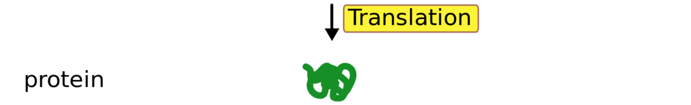
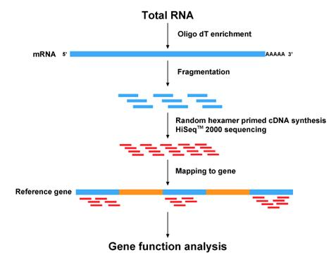

# Uvod {#uvod}

Dezoksiribonukleinska kiselina (DNA) je molekul nosilac naslednih informacija. Kod eukariotskih organizama, najveci broj ovih molekula nalazi se u jedru celije, a manji broj u organelama kao sto su mitohondrije i hloroplasti (u biljkama). Uglavnom je organizovana u hromozome - dugačke vlaknaste strukture. Kod čoveka je hromozom dvostruki, spiralno uvijeni lanac od 50 do 250 miliona nukleotida. Jedan segment tog niza koji kodira molekul ribonukleinske kiseline (RNA) naziva se **gen**, a ceo skup genetskih instrukcija koje nosi neki organizam - **genom**. Humani genom sadrži više od 20,000 gena.

RNA kao i DNA molekuli su nizovi nukleotida. Nukleotidi koji čine DNA su adenin (A), guanin (G), citozin (C) i timin (T), dok se kod RNA timin zamenjuje uracilom (U).

Svaka ćelija našeg organizma sadrzi praktično istu DNA (osim u [haploidnim](https://sr.wikipedia.org/wiki/%D0%9F%D0%BB%D0%BE%D0%B8%D0%B4%D0%B8%D1%98%D0%B0) polnim ćelijama), ali neke od tih ćelija vrše potpuno različite funkcije. Folikularna celija stitaste zlezde i glatka misicna ćelija ocigledno imaju drasticno razlicit metabolizam, ali kako kada je osnovni genetski kod isti?

## Centralna dogma molekularne biologije

(pre)pojednostavljeno: “DNA gradi RNA, RNA gradi proteine, proteini grade nas.”

Centralna dogma molekularne biologije definise glavni smer toka biološke informacije: DNA kodira RNA, a RNA kodira protein.

 

U ovom toku informacije razlikujemo tri glavna procesa:

1. Informacija sadržana u segmentu DNA niza se može kopirati u RNA kroz proces koji nazivamo **transkripcija** uz posredstvo enzima RNA-polimeraze.
2. Informacijska RNA (mRNA) nastaje od pre-mRNA procesom **splajsovanja**, u kojem se uklanjaju tzv. intronske regije (introni).
3. **Translacijom** nazivan proces sintetizovanja proteina nizanjem amino kiselina po mRNA šablonu. Translacija se obavlja unutar ribozoma - organele sačinjene od ribozomalne RNA (rRNA) i proteina.

 
<iframe width="560" height="315" align="middle" src="https://www.youtube.com/embed/2BwWavExcFI" frameborder="0" allowfullscreen></iframe>
 

Ovo je pojednostavljeno vidjenje jer postoje i efekti suprotnog smera. Intinuitivno nam je jasno da aktivnost odredjenog gena varira u vremenu i od celije do celije - dakle neki sistem regulacije postoji.

 

 

Promoterski region je segment duzine 100-1000 baza koji se nalazi uz gen na 5' strani. Ovde se inicijalno vezuje RNA-polimeraza i zapocinje proces transkripcije. Pojacivaci (*enhancers*) mogu biti i udaljeni od pocetka gena i locirani u bilo kom pravcu. Na njih se vezuju transcription faktori koji interaguju sa RNA-polimerazom i tako povećavaju šansu da dođe to transkripcije. Postoje i regioni koje imaju suprotnu regulatornu ulogu.

 

 

Prvi proizvod transkripcije je takozvani primarni transkript (pre-mRNA). On je doslovno prepisan *coding strand* od pocetka do kraja gena, osim sto je svako T zamenjeno sa U^[Khan Academy ima odlicnu ilustraciju citavog procesa transkripcije [ovde](https://www.khanacademy.org/science/biology/gene-expression-central-dogma/transcription-of-dna-into-rna/a/overview-of-transcription?modal=1)]. U procesu formiranja zrele RNA intronske sekvence bivaju uklonjene.

 

 

Sinteza proteina se obavlja u ribozomima u procesu u kojem se kod zapisan sa cetiri nukleinske kiseline prevodi u kod 20 aminokiselina koje se nizu po odredjenom obrascu. Ulogu prevodioca igraju tRNA molekuli koji jednim svojim krajem prepoznaju odgovarajuci (komplementaran) kodon^[Kodon = niz od 3 susedna nukleotida. Triplet je i najkraci niz nukleotida koji moze da kodira 20 razlicitih aminokiselina jer je $4^{3}>20$.] na mRNA, a na drugom kraju nose odgovarajuću aminokiselinu.

UTR = *untranslated region*, ne kodira protein.

 

 

Spomenuli smo ribozome i tRNA, pa je vreme da napomenemo da postoji vise vrsta RNA molekula: informacijska (mRNA), transfer RNA (tRNA), ribosomalna RNA (rRNA), kratka i duga nekodirajuca RNA (ncRNA).

Informacijska ili messenger RNA (mRNA) zastupljena je sa oko ~5% u ćelijama sisara, ribozomalna RNA (rRNA) ~80%, transportna RNA koja takođe učestvuje u procesu translacije (tRNA) ~15% ... 

 

 

## Transkripti

Od jednog gena, nakon slajsinga, mogu nastati razlicite varijante mRNA molekula koje nazivamo **transkripti** (ili **izoforme**). Ekvivalentno relaciji gen-genom, 'katalog' svih mogućih transkripata zovemo **transkritom**.

 

Alternativno splajsovanje je proces kojim od pre-mRNA koji je doslovno prepisan DNA kod nastaje mRNA koji će kodirati protein. Splajsovanjem dolazi do odstranjivanja intronskih regija (introna), ali se isto može desiti i pojedinim eksonima. Rezultujući različiti mRNA molekuli mogu biti translirani u različite proteine, odnosno - jedan gen može da kodira više proteina.

Alternativno splajsovanje se javlja kao normalna pojava kod eukariota, gde znatno povećava raznovrsnost proteina. Kod ljudi preko 80% gena su alternativno splajsovani. Brojni modovi alternativnog splajsovanja su uočeni, od kojih najčešći jeste preskakanje eksona. U tom modu, pojedini ekson može biti uključen u mRNA pod nekim uslovima ili u pojedinim tkivima, i izostavljen iz mRNA u drugim.

Ovo je nešto što će otežati problem alignmenta (poravnanja) na referentni genom. Aligner mora biti 'splice aware'!

## DNA microarrays

- Around since late 80's.
- Microscope slides with thousands of tiny spots, each spot containing a known DNA sequence or gene. These sequences act as probes to detect gene expression.
- Molecules in the sample are labeled with fluorescent probes.
- The process in which the sample molecules bind to the DNA probes on the slide is called hybridization. 
- Following hybridization, the microarray is scanned to measure the expression of each gene printed on the slide. 
    
 
<iframe width="560" height="315" src="https://www.youtube.com/embed/1_wDrqgS8w8" frameborder="0" allowfullscreen></iframe>
 

## RNA-Seq

- A major breakthrough (replaced microarrays) in the late 00’s and has been widely used since.
- Uses next-generation sequencing (NGS) to reveal the presence and quantity of RNA in a biological sample at a given moment.
- Able to detect novel (undiscovered) isoforms and has a broader dynamic range compapred to microarrays.

 

 
    
 
<iframe width="560" height="315" src="https://www.youtube.com/embed/womKfikWlxM" frameborder="0" allowfullscreen></iframe>
 

Choosing the appropriate sequencing protocol:

- Most of the RNA in a cell is ribosomal RNA (an RNA component of ribosome which is approx 60% rRNA and 40% protein). This is an issue since most scientists (and enthusiasts like us) will be interested in mRNA because of its protein coding function. There are two popular methods for increasing mRNA concentration in your samples:

    1. poly (A) capture 
    2. ribosomal RNA depletion

- There are also total-RNA protocols that do not enrich for a specific RNA type - for "total RNA" studies;
- Different fragment sizes;
- Bulk or single cell RNA-Seq;
- ...

Then what? Microarrays or RNA-Seq!

## RNA-Seq analysis goals

- Reconstruct the full set of transcripts (isoforms) of genes that were present in the original cells. This catalogue of transcripts is called **transcriptome**. 
- Estimate the expression levels for all transcripts. 

Why measure gene expression?

Proteini (belančevine) predstavljaju za žive sisteme najznačajnije organske molekule. Osim što izgrađuju ćeliju i njene delove, proteini obavljaju i sve osnovne funkcije u organizmu. 

Izuzetno je komplikovano direktno izmeriti relativnu zastupljenost određenog proteina u uzorku. Zato merimo relativnu zastupljenost mRNA molekula koji kodira taj protein!

**Because gene expression correlates with protein expression!**

Even though nearly every cell in an organism's body contains the same set of genes, only a fraction of these genes are used in any given cell at any given time. It is this carefully controlled pattern of what is called "gene expression" that makes a liver cell different from a muscle cell, and a healthy cell different from a cancer cell. 

By measuring gene expression, we can identify active and inactive genes in a cell or tissue. This knowledge is important for drug discovery and creating diagnostic tests.

