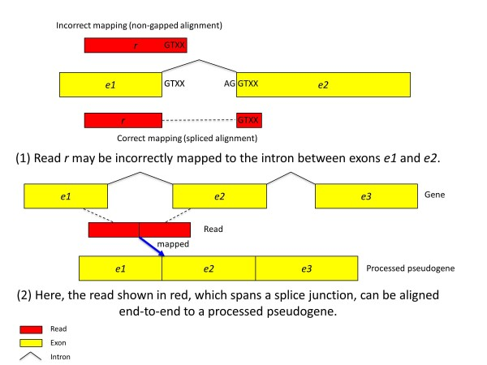
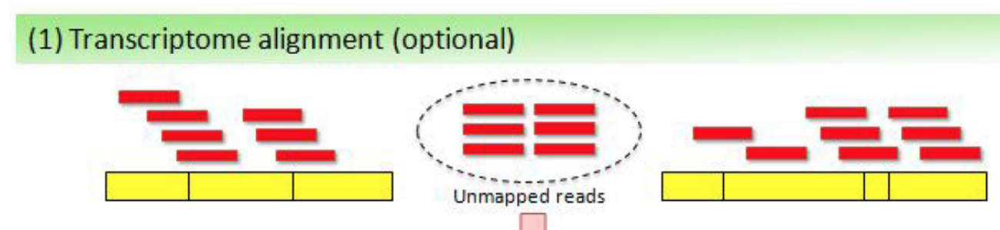
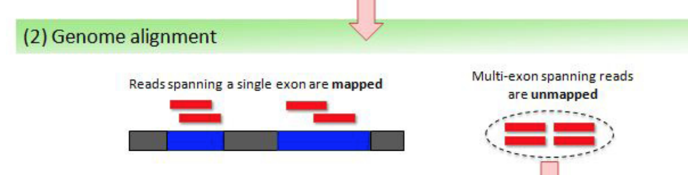
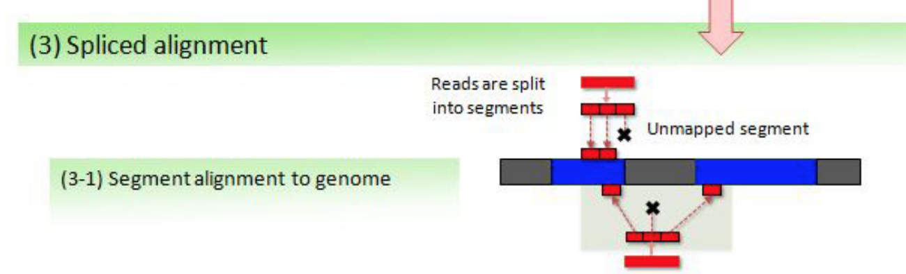
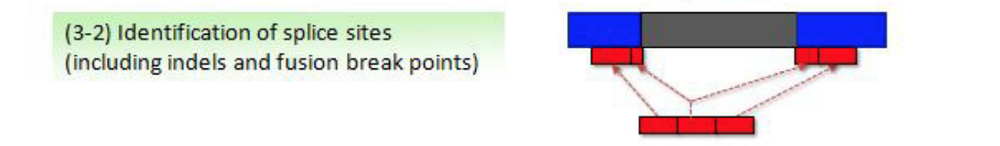
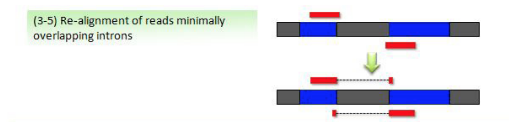
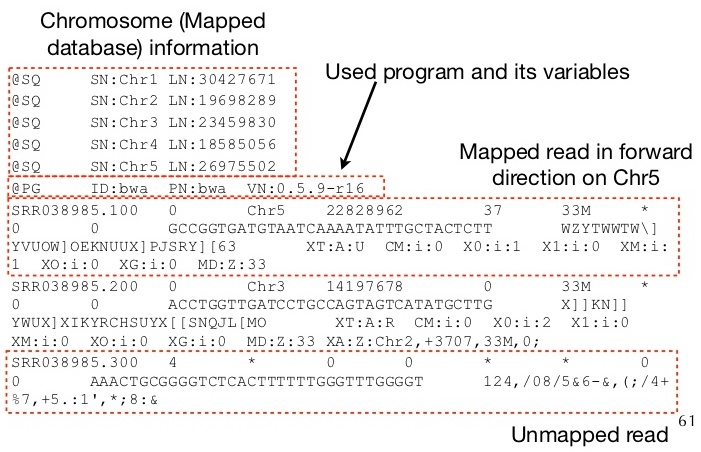

# Poravnanje {#poravnanje}

```{r, include = FALSE}
library(reticulate)
use_condaenv("compbio", required = TRUE)
```

\* Adapted from [Tophat2 paper](https://genomebiology.biomedcentral.com/articles/10.1186/gb-2013-14-4-r36)


## Alignment challenges

The first step in the analysis process is to map the RNA-Seq reads against the reference genome, which provides the location from which the reads originated. 

In contrast to DNA-Seq alignment, RNA-Seq mapping algorithms have two additional challenges:

1. Because genes contain introns, and because reads sequenced from mature mRNA transcripts do not include these introns, any RNA-Seq alignment algorithm must be able to handle gapped (or spliced) alignment with very large gaps. In mammalian genomes, introns span a very wide range of lengths, typically from 50 to 100,000 bases, which the alignment algorithm must accommodate. 

2. The presence of processed pseudogenes, from which some or all introns have been removed, may cause many exon-spanning reads to map incorrectly. This is particularly acute for the human genome, which contains over 14,000 pseudogenes.

Some numbers (Ensembl GRCh37 gene annotations, release 66 from 2012):

- average length of a mature mRNA transcript in the human genome is 2,227 bp.
- average exon length is 235 bp.
- average number of exons per transcript is 9.5. 

Assuming that sequencing reads are uniformly distributed along a transcript, we would expect 33 to 38% of 100 bp reads from an RNA-Seq experiment to span two or more exons. Note that this proportion increases significantly as read length increases.

More important for the alignment problem is that around 20% of junction-spanning reads extend by 10 bp or less into one of the exons they span.



1. A read extending a few bases into the flanking exon can be aligned to the intron instead of the exon. 
2. A read spanning multiple exons from genes with processed pseudogene copies can be aligned to the pseudogene copies instead of the gene from which it originates.

### How Tophat2 handles these issues

1. If a read extends only a few bases into one of two adjacent exons, then it often happens that the read will align equally well, but incorrectly, with the sequence of the intervening intron. To handle this problem, the appropriate algorithm detects potential splice sites for introns (GT-AG, GC-AG, and AT-AC). It uses these candidate splice sites in a subsequent step to correctly align multiexon-spanning reads.

2. Concerning the human genome, for which there are relatively comprehensive annotations of protein-coding genes, the annotations can be used to map reads more accurately by aligning the reads preferentially to real genes rather than pseudogenes.

## Tophat2 algorithm




Given RNA-Seq reads as input, TopHat2 begins by mapping reads against the known transcriptome (if available).



TopHat2 aligns unmapped reads against the genome. Any reads contained entirely within exons will be mapped, whereas other spanning introns may not be.



The unmapped reads are split into smaller non-overlapping segments (25 bp each by default) which are then aligned against the genome.



Tophat2 examines any cases in which the left and right segments of the same read are mapped within a user-defined maximum intron size (usually between 50 and 100,000 bp). When this pattern is detected, TopHat2 re-aligns the entire read sequence to that genomic region in order to identify the most likely location of the splice site. It pays attention to the known junction signals (GT-AG, GC-AG, and AT-AC). The resulting spliced sequences are collected as a set of potential transcript fragments. Any reads not mapped in the previous stages (or mapped very poorly) are then re-aligned against this novel transcriptome.



After these steps, some of the reads may have been aligned incorrectly by extending an exonic alignment a few bases into the adjacent intron. TopHat2 checks if such alignments extend into the introns identified in the split-alignment phase; if so, it can realign these reads to the adjacent exons instead.

In the final stage, TopHat2 divides the reads into those with unique alignments and those with multiple alignments. For the multi-mapped reads, TopHat2 gathers statistical information (for example, the number of supporting reads) about the relevant splice junctions, insertions, and deletions, which it uses to recalculate the alignment score for each read. Based on these new alignment scores, TopHat2 reports the most likely alignment locations for such multi-mapped reads.

For paired-end reads, TopHat2 processes the two reads separately through the same mapping stages described above. In the final stage, the independently aligned reads are analyzed together to produce paired alignments, taking into consideration additional factors including fragment length and orientation.

## Alignment file



CIGAR: a string describing how the read aligns with the reference. It consists of one or more components. Each component comprises an operator and the number of bases which the operator applies to. Operators are: MIDNSHP=X.

https://broadinstitute.github.io/picard/explain-flags.html

**pysam** is a Python package that wraps the functionality of the Samtools toolkit and enables many useful manipulations of SAM/BAM files. 

cigar types in pysam:

- 0 - alignment match (can be a sequence match or mismatch)
- 1 - insertion to the reference;
- 2 - deletion from the reference
- 3 - skipped region from the reference    
- 4 - soft clipping (clipped sequences present in SEQ)
- 5 - hard clipping (clipped sequences NOT present in SEQ)
- 6 - padding (silent deletion from padded reference)
- 7 - sequence match
- 8 - sequence mismatch

```{python}
import pysam

bamfile = pysam.AlignmentFile("/opt/aligned/sample_03_accepted_hits.bam", "rb")

for read in bamfile.fetch():
    for (cigarType, cigarLength) in read.cigar:
        if cigarType == 3:
            print(read.cigar)
            print(read)
            break
    else:
        continue
    break

    
bamfile.close()
```


